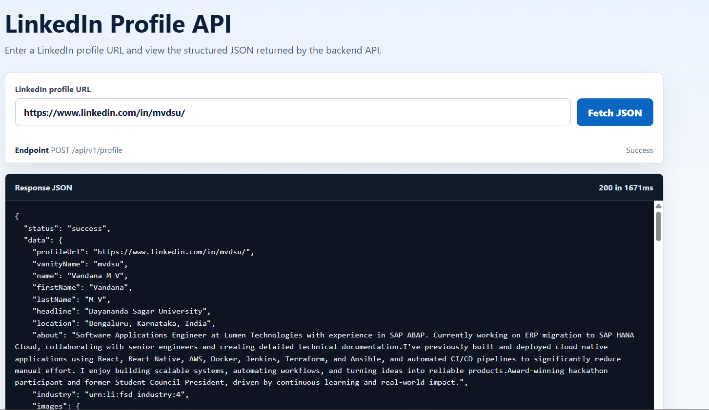

# LinkedIn Profile API

A browserless Express API that accepts a LinkedIn profile URL and returns structured JSON for the profile fields available to the authenticated LinkedIn session configured in the backend.

## Live Demo

Hosted API and tester page:

https://linkedin-profile-api-rq4o.onrender.com/

## Screenshot



## Features

- Accepts LinkedIn profile URLs from `linkedin.com/in/...`
- Uses an authenticated LinkedIn web session through `li_at` and `JSESSIONID` cookies
- Directly calls LinkedIn Voyager endpoints from the backend with Axios
- Does not use Puppeteer, Playwright, Selenium, or browser automation
- Returns profile metadata, images, about, experience, education, skills, certifications, and languages when LinkedIn returns those sections
- Includes a small hosted tester page at `/` for quickly pasting a profile URL and viewing JSON
- Provides health-check and Docker support for hosted HTTPS deployments
- Keeps credentials out of source control through environment variables

## Tech Stack

- Node.js 20
- Express 5
- Axios
- Docker-ready

## Setup

```bash
npm install
cp .env.example .env
```

Update `.env` with your LinkedIn cookies:

```env
PORT=3000
LINKEDIN_LI_AT=your_li_at_cookie_here
LINKEDIN_JSESSIONID="ajax:your_jsessionid_cookie_here"
```

Start the API:

```bash
npm start
```

For development with automatic restart:

```bash
npm run dev
```

Run syntax checks:

```bash
npm test
```

## API Documentation

### Browser Tester

```http
GET /
```

Opens a minimal tester page where a reviewer can paste a LinkedIn profile URL and see the JSON returned by `POST /api/v1/profile`.

Live tester:

```text
https://linkedin-profile-api-rq4o.onrender.com/
```

### Health Check

```http
GET /api/v1/health
```

Response:

```json
{
  "status": "ok"
}
```

### Parse LinkedIn Profile

```http
POST /api/v1/profile
Content-Type: application/json
```

Request body:

```json
{
  "url": "https://www.linkedin.com/in/example-profile/"
}
```

You can also call it with a query parameter:

```http
GET /api/v1/profile?url=https://www.linkedin.com/in/example-profile/
```

Hosted example:

```powershell
Invoke-RestMethod "https://linkedin-profile-api-rq4o.onrender.com/api/v1/profile?url=https://www.linkedin.com/in/mvdsu/" |
ConvertTo-Json -Depth 20
```

Successful response:

```json
{
  "status": "success",
  "data": {
    "profileUrl": "https://www.linkedin.com/in/example-profile/",
    "vanityName": "example-profile",
    "name": "Example Person",
    "firstName": "Example",
    "lastName": "Person",
    "headline": "Software Engineer",
    "location": "Bengaluru, Karnataka, India",
    "about": "Profile summary text when available",
    "industry": "Technology",
    "images": {
      "profile": "https://media.licdn.com/...",
      "background": "https://media.licdn.com/..."
    },
    "experience": [
      {
        "title": "Software Engineer",
        "company": "Example Company",
        "location": "Bengaluru",
        "description": "Role description",
        "dateRange": {
          "start": {
            "year": 2024,
            "month": 1,
            "day": null,
            "formatted": "2024-01"
          },
          "end": null,
          "isCurrent": true
        },
        "companyLogo": "https://media.licdn.com/..."
      }
    ],
    "education": [],
    "skills": [
      {
        "name": "JavaScript",
        "endorsementCount": null
      }
    ],
    "certifications": [],
    "languages": []
  }
}
```

Error response:

```json
{
  "status": "error",
  "message": "Parameter \"url\" is required."
}
```

## Approach

The API extracts the LinkedIn vanity name from the submitted profile URL, then calls LinkedIn's Voyager web API using backend session cookies. The implementation is purely reverse engineered and browserless: it does not automate login, render LinkedIn pages, or scrape DOM content.

It first resolves the main profile response with LinkedIn's full-profile decoration, extracts the profile URN, and then requests profile sections concurrently:

- position groups for experience
- education records
- skills
- certifications
- languages

The parser normalizes LinkedIn's nested text, vector image, and date structures into a predictable JSON shape.

## Deployment

This app can be deployed to Render, Railway, Fly.io, Azure App Service, AWS, or any Docker-compatible host.

### Docker

```bash
docker build -t linkedin-profile-api .
docker run -p 3000:3000 --env-file .env linkedin-profile-api
```

### Render/Railway-style Environment Variables

Set these environment variables in the hosting dashboard:

- `PORT`
- `LINKEDIN_LI_AT`
- `LINKEDIN_JSESSIONID`

Use the platform's HTTPS URL as the public API base URL.

## Security Notes

- Do not commit `.env` or LinkedIn cookies.
- Rotate LinkedIn cookies if they are ever exposed.
- Use deployment secret/environment settings for production credentials.
- Consider adding a public API key or rate limit before exposing the profile endpoint broadly.

## Known Limitations

- LinkedIn Voyager is a private, undocumented API, so endpoint shapes may change.
- Returned fields depend on what the configured LinkedIn account is allowed to view.
- Some profiles hide sections such as location, skills, or education based on privacy settings.
- Session cookies expire and must be refreshed in deployment environment variables.
- The implementation does not bypass CAPTCHAs, login checkpoints, private profiles, or LinkedIn access controls.
